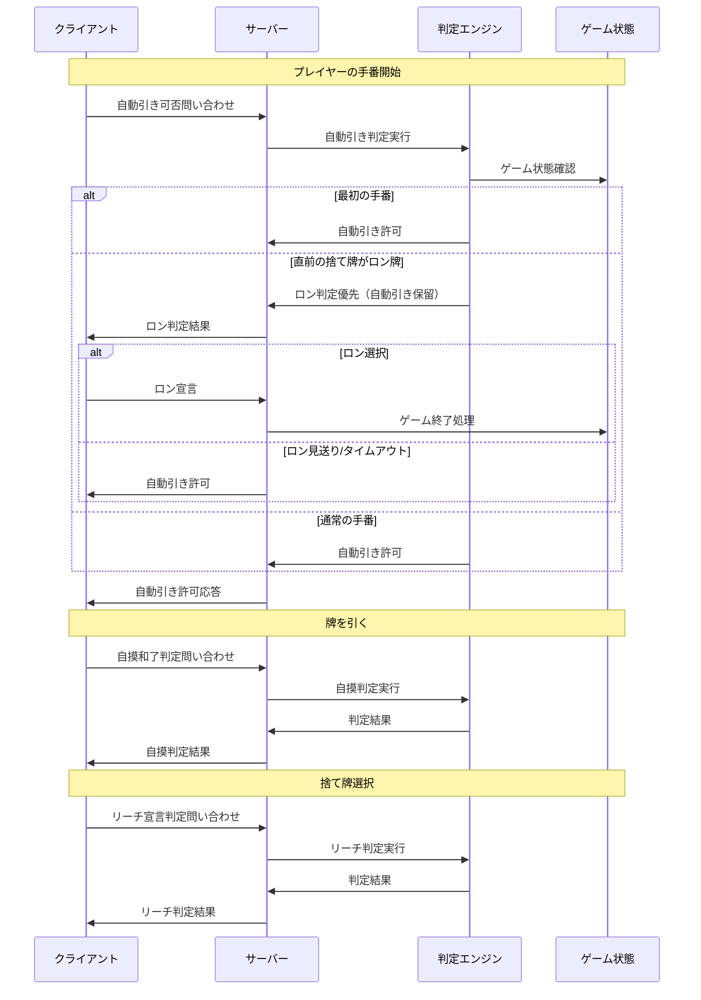

# 設計書

## 概要

麻雀ゲームにおけるサーバー集中判定システムを実装します。リーチ判定、ツモ判定、ロン判定、自動引き判定をすべてサーバーサイドで行い、クライアントはサーバーに問い合わせを行って許可を得る仕組みに変更します。これにより、判定の一貫性と公正性を確保します。

## アーキテクチャ

### 設計原則

1. **サーバー集中判定**: すべての判定処理をサーバーサイドで実行
2. **クライアント問い合わせ**: クライアントは判定が必要な時にサーバーに問い合わせ
3. **統一応答フォーマット**: すべての判定結果を統一されたフォーマットで応答
4. **状態同期**: サーバーがゲーム状態の唯一の真実の源となる

### システム全体フロー



## コンポーネントと インターフェース

### 1. サーバーサイド実装

#### JudgmentEngine.js（新規作成）

**判定エンジンの中核クラス**
```javascript
class JudgmentEngine {
  // 自動引き判定
  canAutoDraw(playerId, gameState) {
    const player = gameState.getPlayer(playerId);
    const isFirstTurn = gameState.isFirstTurn(playerId);
    
    if (isFirstTurn) {
      return { allowed: true, reason: 'first_turn' };
    }
    
    const lastDiscardedTile = gameState.getLastDiscardedTile();
    const canRon = this.checkRon(playerId, lastDiscardedTile, gameState);
    
    if (canRon.possible) {
      return { allowed: false, reason: 'ron_available', ronData: canRon };
    }
    
    return { allowed: true, reason: 'normal_turn' };
  }
  
  // 自摸和了判定
  checkTsumo(playerId, drawnTile, gameState) {
    const player = gameState.getPlayer(playerId);
    const hand = [...player.hand, drawnTile];
    
    return this.checkWinning(hand, player.isRiichi);
  }
  
  // ロン判定
  checkRon(playerId, discardedTile, gameState) {
    const player = gameState.getPlayer(playerId);
    const hand = [...player.hand, discardedTile];
    
    return this.checkWinning(hand, player.isRiichi);
  }
  
  // リーチ宣言判定
  checkRiichi(playerId, discardTile, gameState) {
    const player = gameState.getPlayer(playerId);
    const handAfterDiscard = player.hand.filter(tile => tile.id !== discardTile.id);
    
    return this.checkTenpai(handAfterDiscard);
  }
}
```

#### server.js の拡張

**判定API エンドポイント**
```javascript
// 自動引き判定API
socket.on('queryAutoDraw', (data) => {
  const { playerId, gameId } = data;
  const game = games[gameId];
  const result = judgmentEngine.canAutoDraw(playerId, game);
  
  socket.emit('autoDrawResult', {
    playerId,
    allowed: result.allowed,
    reason: result.reason,
    ronData: result.ronData || null
  });
});

// 自摸判定API
socket.on('queryTsumo', (data) => {
  const { playerId, gameId, drawnTile } = data;
  const game = games[gameId];
  const result = judgmentEngine.checkTsumo(playerId, drawnTile, game);
  
  socket.emit('tsumoResult', {
    playerId,
    possible: result.possible,
    winData: result.winData || null
  });
});

// ロン判定API
socket.on('queryRon', (data) => {
  const { playerId, gameId, discardedTile } = data;
  const game = games[gameId];
  const result = judgmentEngine.checkRon(playerId, discardedTile, game);
  
  socket.emit('ronResult', {
    playerId,
    possible: result.possible,
    winData: result.winData || null
  });
});

// リーチ判定API
socket.on('queryRiichi', (data) => {
  const { playerId, gameId, discardTile } = data;
  const game = games[gameId];
  const result = judgmentEngine.checkRiichi(playerId, discardTile, game);
  
  socket.emit('riichiResult', {
    playerId,
    possible: result.possible,
    waitingTiles: result.waitingTiles || []
  });
});
```

### 2. クライアントサイド実装

#### JudgmentClient.js（新規作成）

**サーバー判定問い合わせクライアント**
```javascript
class JudgmentClient {
  constructor(socketManager) {
    this.socketManager = socketManager;
    this.setupEventListeners();
  }
  
  // 自動引き問い合わせ
  async queryAutoDraw(playerId, gameId) {
    return new Promise((resolve) => {
      this.socketManager.safeEmit('queryAutoDraw', { playerId, gameId });
      
      const handler = (data) => {
        if (data.playerId === playerId) {
          this.socketManager.socket.off('autoDrawResult', handler);
          resolve(data);
        }
      };
      
      this.socketManager.socket.on('autoDrawResult', handler);
    });
  }
  
  // 自摸判定問い合わせ
  async queryTsumo(playerId, gameId, drawnTile) {
    return new Promise((resolve) => {
      this.socketManager.safeEmit('queryTsumo', { playerId, gameId, drawnTile });
      
      const handler = (data) => {
        if (data.playerId === playerId) {
          this.socketManager.socket.off('tsumoResult', handler);
          resolve(data);
        }
      };
      
      this.socketManager.socket.on('tsumoResult', handler);
    });
  }
  
  // ロン判定問い合わせ
  async queryRon(playerId, gameId, discardedTile) {
    return new Promise((resolve) => {
      this.socketManager.safeEmit('queryRon', { playerId, gameId, discardedTile });
      
      const handler = (data) => {
        if (data.playerId === playerId) {
          this.socketManager.socket.off('ronResult', handler);
          resolve(data);
        }
      };
      
      this.socketManager.socket.on('ronResult', handler);
    });
  }
  
  // リーチ判定問い合わせ
  async queryRiichi(playerId, gameId, discardTile) {
    return new Promise((resolve) => {
      this.socketManager.safeEmit('queryRiichi', { playerId, gameId, discardTile });
      
      const handler = (data) => {
        if (data.playerId === playerId) {
          this.socketManager.socket.off('riichiResult', handler);
          resolve(data);
        }
      };
      
      this.socketManager.socket.on('riichiResult', handler);
    });
  }
}
```

#### script.js の修正

**サーバー判定に基づく処理フロー**
```javascript
// 手番開始時の自動引き問い合わせ
async function handleTurnStart(playerId) {
  const result = await judgmentClient.queryAutoDraw(playerId, gameState.gameId);
  
  if (result.allowed) {
    // 自動引き実行
    await drawTile();
  } else if (result.reason === 'ron_available') {
    // ロン判定を表示
    showRonOption(result.ronData);
  }
}

// 牌を引いた後の自摸判定
async function handleTileDrawn(drawnTile) {
  const result = await judgmentClient.queryTsumo(
    gameStateManager.getPlayerId(), 
    gameState.gameId, 
    drawnTile
  );
  
  if (result.possible) {
    showTsumoOption(result.winData);
  }
}

// 相手の捨て牌に対するロン判定
async function handleOpponentDiscard(discardedTile) {
  const result = await judgmentClient.queryRon(
    gameStateManager.getPlayerId(),
    gameState.gameId,
    discardedTile
  );
  
  if (result.possible) {
    showRonOption(result.winData);
  }
}

// 捨て牌選択時のリーチ判定
async function handleTileSelection(selectedTile) {
  const result = await judgmentClient.queryRiichi(
    gameStateManager.getPlayerId(),
    gameState.gameId,
    selectedTile
  );
  
  if (result.possible) {
    showRiichiOption(result.waitingTiles);
  }
}
```

## データモデル

### 判定結果の統一フォーマット

```javascript
// 自動引き判定結果
{
  playerId: string,
  allowed: boolean,
  reason: 'first_turn' | 'ron_available' | 'normal_turn',
  ronData?: {
    possible: boolean,
    winData: WinData
  }
}

// 自摸判定結果
{
  playerId: string,
  possible: boolean,
  winData?: {
    han: number,
    fu: number,
    yakuList: string[],
    points: number
  }
}

// ロン判定結果
{
  playerId: string,
  possible: boolean,
  winData?: WinData
}

// リーチ判定結果
{
  playerId: string,
  possible: boolean,
  waitingTiles?: Tile[]
}
```

### GameState モデルの拡張

```javascript
class GameState {
  constructor() {
    // 既存のプロパティ
    this.currentTurn = 0;
    this.turnHistory = []; // 手番履歴
    this.lastDiscardedTile = null;
    this.pendingJudgments = new Map(); // 保留中の判定
  }
  
  // 最初の手番かどうかの判定
  isFirstTurn(playerId) {
    return this.turnHistory.length === 0 || 
           this.turnHistory.every(turn => turn.playerId !== playerId);
  }
  
  // 最後に捨てられた牌を取得
  getLastDiscardedTile() {
    return this.lastDiscardedTile;
  }
  
  // 判定を保留状態に設定
  setPendingJudgment(playerId, judgmentType, data) {
    this.pendingJudgments.set(`${playerId}_${judgmentType}`, {
      playerId,
      type: judgmentType,
      data,
      timestamp: Date.now()
    });
  }
  
  // 保留中の判定を取得
  getPendingJudgment(playerId, judgmentType) {
    return this.pendingJudgments.get(`${playerId}_${judgmentType}`);
  }
  
  // 保留中の判定をクリア
  clearPendingJudgment(playerId, judgmentType) {
    this.pendingJudgments.delete(`${playerId}_${judgmentType}`);
  }
}
```

### Player モデルの拡張

```javascript
class Player {
  constructor(id, name) {
    // 既存のプロパティ
    this.id = id;
    this.name = name;
    this.hand = [];
    this.isRiichi = false;
    this.discardedTiles = [];
    
    // 新しいプロパティ
    this.lastDrawnTile = null;
    this.judgmentHistory = []; // 判定履歴
    this.pendingActions = new Set(); // 保留中のアクション
  }
  
  // 最後に引いた牌を記録
  setLastDrawnTile(tile) {
    this.lastDrawnTile = tile;
  }
  
  // 判定履歴を追加
  addJudgmentHistory(type, result, timestamp = Date.now()) {
    this.judgmentHistory.push({
      type,
      result,
      timestamp
    });
  }
  
  // 保留中のアクションを管理
  addPendingAction(action) {
    this.pendingActions.add(action);
  }
  
  removePendingAction(action) {
    this.pendingActions.delete(action);
  }
  
  hasPendingAction(action) {
    return this.pendingActions.has(action);
  }
}
```

## エラーハンドリング

### 1. 判定API のエラーハンドリング

```javascript
// サーバーサイドの統一エラーハンドリング
class JudgmentErrorHandler {
  static handleJudgmentError(error, judgmentType, playerId) {
    const errorResponse = {
      success: false,
      error: {
        type: error.name || 'JudgmentError',
        message: error.message,
        judgmentType,
        playerId,
        timestamp: Date.now()
      }
    };
    
    // ログ出力
    console.error(`判定エラー [${judgmentType}] プレイヤー: ${playerId}`, error);
    
    return errorResponse;
  }
  
  static validateGameState(gameState, playerId) {
    if (!gameState) {
      throw new Error('ゲーム状態が存在しません');
    }
    
    const player = gameState.getPlayer(playerId);
    if (!player) {
      throw new Error(`プレイヤー ${playerId} が見つかりません`);
    }
    
    return { gameState, player };
  }
}
```

### 2. クライアントサイドのタイムアウト処理

```javascript
// 判定問い合わせのタイムアウト処理
class JudgmentClient {
  async queryWithTimeout(queryFunction, timeoutMs = 5000) {
    return Promise.race([
      queryFunction(),
      new Promise((_, reject) => {
        setTimeout(() => {
          reject(new Error('判定問い合わせがタイムアウトしました'));
        }, timeoutMs);
      })
    ]);
  }
  
  async safeQuery(queryType, ...args) {
    try {
      return await this.queryWithTimeout(() => this[queryType](...args));
    } catch (error) {
      console.error(`判定問い合わせエラー [${queryType}]:`, error);
      
      // フォールバック処理
      return this.getFallbackResult(queryType, error);
    }
  }
  
  getFallbackResult(queryType, error) {
    // タイムアウトや通信エラー時のフォールバック
    switch (queryType) {
      case 'queryAutoDraw':
        return { allowed: true, reason: 'fallback_timeout' };
      case 'queryTsumo':
      case 'queryRon':
      case 'queryRiichi':
        return { possible: false, reason: 'fallback_timeout' };
      default:
        return { success: false, error: error.message };
    }
  }
}
```

### 3. 状態整合性の検証

```javascript
// ゲーム状態の整合性チェック
class StateValidator {
  static validatePlayerHand(player) {
    if (!Array.isArray(player.hand)) {
      throw new Error('プレイヤーの手牌が配列ではありません');
    }
    
    if (player.hand.length < 1 || player.hand.length > 14) {
      throw new Error(`不正な手牌数: ${player.hand.length}枚`);
    }
    
    return true;
  }
  
  static validateGameFlow(gameState, playerId, action) {
    const player = gameState.getPlayer(playerId);
    
    // 手番チェック
    if (gameState.currentPlayer !== playerId && action !== 'queryRon') {
      throw new Error('手番外の操作です');
    }
    
    // リーチ状態チェック
    if (player.isRiichi && action === 'queryRiichi') {
      throw new Error('既にリーチ宣言済みです');
    }
    
    return true;
  }
  
  static validateTileOperation(player, tile, operation) {
    switch (operation) {
      case 'discard':
        if (!player.hand.some(t => t.id === tile.id)) {
          throw new Error('手牌にない牌を捨てようとしています');
        }
        break;
      case 'draw':
        if (player.hand.length >= 14) {
          throw new Error('手牌が満杯で牌を引けません');
        }
        break;
    }
    
    return true;
  }
}
```

## テスト戦略

### 1. 単体テスト

- **JudgmentEngine.canAutoDraw()**: 各種条件での自動引き判定
- **JudgmentEngine.checkTsumo()**: 自摸和了判定の正確性
- **JudgmentEngine.checkRon()**: ロン判定の正確性
- **JudgmentEngine.checkRiichi()**: リーチ宣言判定の正確性
- **StateValidator**: 状態整合性チェック機能

### 2. 統合テスト

- **判定API フロー**: クライアント問い合わせ → サーバー判定 → 応答
- **自動引き制御**: 最初の手番、ロン優先、通常手番の各パターン
- **エラーハンドリング**: タイムアウト、通信エラー、状態エラーの処理
- **状態同期**: サーバー・クライアント間の判定結果同期

### 3. エンドツーエンドテスト

- **完全なゲームフロー**: 手番開始 → 自動引き問い合わせ → 牌引き → 自摸判定
- **ロン判定フロー**: 相手の牌捨て → ロン問い合わせ → ロン実行
- **リーチフロー**: 捨て牌選択 → リーチ判定 → リーチ宣言
- **複数プレイヤー**: 同時判定問い合わせの処理

## パフォーマンス考慮事項

### 1. 判定処理の最適化

- 判定ロジックのキャッシュ化
- 不要な判定処理の早期リターン
- 並列判定処理の制限（同時問い合わせ数の制御）

### 2. ネットワーク通信の最適化

- 判定結果の圧縮
- 不要な状態更新の削減
- 接続プールの効率的な管理

### 3. メモリ管理

- 判定履歴の適切なクリーンアップ
- 保留中の判定のタイムアウト処理
- イベントリスナーのメモリリーク防止

## セキュリティ考慮事項

### 1. 判定の改ざん防止

- サーバーサイドでの完全な判定処理
- クライアントからの判定結果の無視
- 判定履歴の改ざん検出

### 2. 不正操作の防止

- 手番外の判定問い合わせの拒否
- 重複判定問い合わせの制限
- レート制限による過剰な問い合わせの防止

### 3. データ整合性の保証

- 判定時のゲーム状態のスナップショット
- 状態変更の原子性保証
- 不正な状態遷移の検出と修正

## 移行戦略

### 1. 段階的移行

1. **フェーズ1**: JudgmentEngineの実装とテスト
2. **フェーズ2**: サーバーAPI の実装
3. **フェーズ3**: クライアント側の問い合わせ機能実装
4. **フェーズ4**: 既存の判定ロジックの無効化
5. **フェーズ5**: 統合テストと本番デプロイ

### 2. 互換性の維持

- 移行期間中の両方式の並行動作
- フィーチャーフラグによる切り替え
- ロールバック機能の実装

### 3. 監視とログ

- 判定処理のパフォーマンス監視
- エラー率の追跡
- 判定結果の整合性チェック