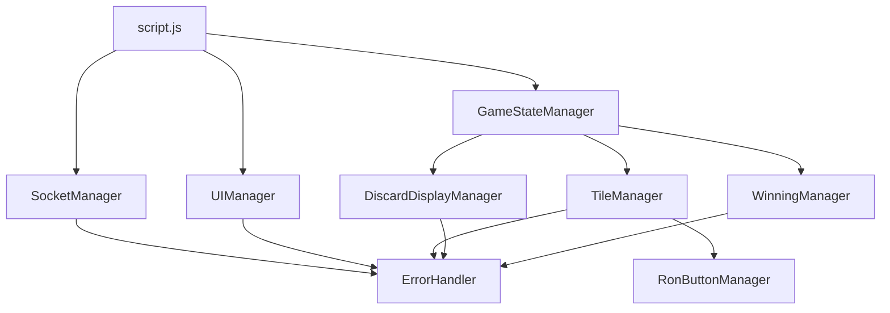

# 設計書

## 概要

現在の`public/script.js`ファイル（約3000行）を機能別に8つのモジュールに分割し、保守性とコードの可読性を向上させます。各モジュールは単一責任の原則に従い、明確なインターフェースを持ちます。

## アーキテクチャ

### ファイル構造

```
public/
├── script.js (メインファイル - 大幅に簡素化)
└── js/
    ├── SocketManager.js (Socket.io通信管理)
    ├── GameStateManager.js (ゲーム状態管理)
    ├── TileManager.js (牌の表示と操作)
    ├── DiscardDisplayManager.js (捨て牌表示管理)
    ├── UIManager.js (UI管理)
    ├── WinningManager.js (上がり判定)
    ├── ErrorHandler.js (エラーハンドリング)
    └── RonButtonManager.js (既存ファイル - 保持)
```

### モジュール間の依存関係



## コンポーネントとインターフェース

### 1. SocketManager.js

**責任**: Socket.io接続とサーバー通信の管理

**主要メソッド**:
- `initialize()`: Socket.io接続の初期化
- `safeEmit(event, data)`: 安全な送信機能
- `setupEventListeners()`: イベントリスナーの設定
- `attemptReconnection()`: 再接続処理
- `updateConnectionStatus(connected)`: 接続状態の更新

**イベント処理**:
- 接続/切断イベント
- ゲーム関連イベント（gameStateUpdate, playerJoined等）
- エラーイベント

### 2. GameStateManager.js

**責任**: ゲーム状態の管理と更新

**主要メソッド**:
- `updateGameState(gameState)`: ゲーム状態の更新
- `getCurrentPlayer()`: 現在のプレイヤー情報取得
- `getOpponent()`: 相手プレイヤー情報取得
- `isMyTurn()`: 自分の手番かチェック
- `getPlayerHand()`: プレイヤーの手牌取得
- `setPlayerId(id)`: プレイヤーID設定

**状態管理**:
- currentGameState
- playerId
- previousGameState（変更検出用）

### 3. TileManager.js

**責任**: 牌の表示、操作、判定機能

**主要メソッド**:
- `displayPlayerHand(tiles, isClickable, drawnTile)`: 手牌表示
- `displayOpponentHand(tileCount)`: 相手手牌表示
- `createTileElement(tile, isClickable, isHidden)`: 牌要素作成
- `handleTileClick(tile, element)`: 牌クリック処理
- `handleTileDoubleClick(tile, element)`: 牌ダブルクリック処理
- `sortTilesForDisplay(tiles)`: 牌のソート
- `checkTenpaiAfterDiscard(hand, tile)`: テンパイ判定
- `clearTileSelection()`: 選択解除

**状態管理**:
- selectedTile

### 4. DiscardDisplayManager.js

**責任**: 捨て牌の表示管理（既存クラスを独立ファイル化）

**主要メソッド**:
- `updateDiscards(gameState, playerId)`: 捨て牌更新
- `displayPlayerDiscards(tiles)`: プレイヤー捨て牌表示
- `displayOpponentDiscards(tiles)`: 相手捨て牌表示
- `createDiscardTileElement(tile, isOpponent)`: 捨て牌要素作成
- `clearDiscards()`: 捨て牌クリア

### 5. UIManager.js

**責任**: ユーザーインターフェースの管理

**主要メソッド**:
- `showGameScreen()`: ゲーム画面表示
- `showWaitingScreen()`: 待機画面表示
- `showGameResult(result)`: 結果画面表示
- `updateButtonStates(gameState, isMyTurn)`: ボタン状態更新
- `updateTurnIndicator(gameState)`: 手番表示更新
- `updateRemainingTiles(count)`: 残り牌数更新
- `updatePlayerStatus(player, isOpponent)`: プレイヤー状態更新
- `startTurnTimer(playerId, timeLimit)`: タイマー開始
- `clearTurnTimer()`: タイマークリア

### 6. WinningManager.js

**責任**: 上がり判定と上がり宣言の管理

**主要メソッド**:
- `updateWinningButtons(gameState, isMyTurn)`: 上がりボタン更新
- `checkCanTsumo(player, hand, isMyTurn)`: ツモ判定
- `checkCanRon(player, gameState, isMyTurn)`: ロン判定
- `checkWinningHand(tiles)`: 完成形判定
- `checkTenpai(tiles)`: テンパイ判定
- `showWinningOptions(canTsumo, canRon)`: 上がりオプション表示
- `hideWinningButtons()`: 上がりボタン非表示

### 7. ErrorHandler.js

**責任**: エラー処理とメッセージ表示

**主要メソッド**:
- `showError(message, duration)`: エラーメッセージ表示
- `showMessage(message, duration)`: 通常メッセージ表示
- `getErrorMessage(errorType, defaultMessage)`: エラーメッセージ取得
- `announceToScreenReader(message)`: スクリーンリーダー対応

### 8. script.js（メインファイル）

**責任**: アプリケーションの初期化とモジュール間の調整

**主要機能**:
- DOM要素の取得
- モジュールの初期化
- グローバルイベントリスナーの設定
- モジュール間の連携調整

## データモデル

### GameState
```javascript
{
  gameId: string,
  players: Array<Player>,
  currentPlayerIndex: number,
  remainingTiles: number,
  playerHandTiles: Array<Tile>
}
```

### Player
```javascript
{
  id: string,
  name: string,
  handSize: number,
  isRiichi: boolean,
  discardedTiles: Array<string|object>,
  lastDrawnTile: Tile
}
```

### Tile
```javascript
{
  id: string,
  suit: 'bamboo'|'honor'|'unknown',
  value: number|string,
  displayText?: string,
  isReachTile?: boolean
}
```

## エラーハンドリング

### エラータイプ
- 通信エラー（接続失敗、送信失敗）
- ゲームロジックエラー（無効な操作、手番違反）
- UI表示エラー（要素が見つからない、表示失敗）

### エラー処理戦略
- 各モジュールは ErrorHandler を使用してエラーを報告
- ユーザーフレンドリーなエラーメッセージの表示
- 自動復旧可能なエラーは自動的に処理
- 重要なエラーはコンソールにログ出力

## テスト戦略

### 単体テスト
- 各モジュールの主要メソッドをテスト
- 牌のソート機能のテスト
- テンパイ判定機能のテスト
- 上がり判定機能のテスト

### 統合テスト
- モジュール間の連携テスト
- ゲーム状態更新の統合テスト
- UI更新の統合テスト

### 既存テスト関数の保持
- `testTileSorting()`
- `testHandDisplay()`
- `testTenpaiCheck()`
- `testRiichiButtonLogic()`
- その他のテスト関数

## 移行戦略

### フェーズ1: モジュール作成
1. 各モジュールファイルを作成
2. 既存コードから該当機能を抽出
3. モジュール間のインターフェースを定義

### フェーズ2: 統合とテスト
1. メインファイルでモジュールを統合
2. 既存機能の動作確認
3. テスト関数の実行確認

### フェーズ3: 最適化
1. 重複コードの削除
2. パフォーマンスの最適化
3. ドキュメントの更新

## 後方互換性

- 既存のグローバル変数とイベントハンドラーを保持
- 既存のテスト関数を維持
- HTML側の変更を最小限に抑制
- 既存の RonButtonManager.js との互換性を保持